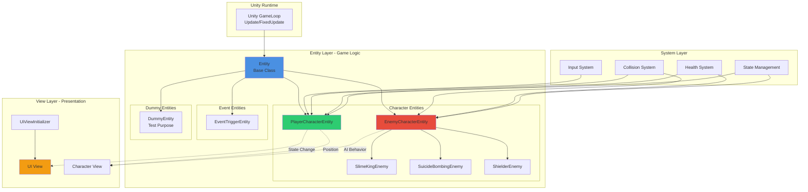

# 🧛 Vampire Survival-like (Unity Portfolio Project)

**Vampire Survivors 스타일의 2D 생존 액션 게임 프로토타입**  
Unity 엔진 기반으로 **확장성과 유지보수성을 고려한 아키텍처 설계**를 목표로 개발한 포트폴리오 프로젝트입니다.

> 🎮 실제 플레이 영상: `vampiresurvival_like.mp4` 포함

## 이 프로젝트의 위치

**메인 포트폴리오의 "Phase 0" - 클라이언트 중심 설계의 한계 경험**

### 설계 경험

이 프로젝트는 **클라이언트에서 모든 로직을 처리**하는 구조입니다.

- ✅ Entity 기반 설계
- ✅ View/Logic 분리
- ⚠️ 모든 상태가 클라이언트에 존재

### 이 경험이 메인 포트폴리오로 이어진 이유

싱글플레이어에서는 문제없지만, **멀티플레이어로 확장하려고 하면**:

1. 클라이언트 간 동기화 문제
2. 치트 방어 불가능
3. 상태 불일치 발생

이 한계를 경험한 후, **Server-authoritative 구조**의 필요성을 
체감하게 되었고, 이것이 메인 포트폴리오의 설계 철학으로 이어졌습니다.

### 핵심 메시지

> "문제를 경험했기 때문에, 더 나은 구조를 설계할 수 있습니다."

---

[메인 포트폴리오: Server-authoritative Architecture 보기](링크)

---

## 🧩 프로젝트 개요

| 항목 | 내용 |
|-----|-----|
| 장르 | 2D Survival / Action |
| 엔진 | Unity |
| 플랫폼 | PC |
| 목적 | 게임 구조 설계 능력 및 코드 품질 중심 포트폴리오 |
| 핵심 키워드 | Entity 기반 구조, 역할 분리, 확장 가능한 설계 |

---

## 🏗️ 아키텍처 설계

본 프로젝트는 **기능 확장과 유지보수에 강한 구조**를 목표로 다음과 같은 레이어 구조로 설계되었습니다.

Script
├─ Entity → 게임 월드의 모든 객체 논리 계층
│ ├─ Character → 플레이어, 몬스터 등 캐릭터 로직
│ ├─ Dummy → 테스트용 엔티티
│ ├─ EventTrigger → 이벤트 트리거 엔티티
│ └─ ...
├─ View → 화면 표현 및 UI
│ ├─ UI
│ └─ ...

## 📐 Entity-based Architecture

---

---

### 설계 원칙

- **Entity 중심**: 모든 게임 오브젝트는 Entity 상속
- **View/Logic 분리**: Entity는 로직만, View는 표현만
- **시스템 분리**: Input, Collision, Health 독립 관리

### 🧠 핵심 설계 원칙

- **Entity 중심 설계**
  - 모든 게임 오브젝트의 로직을 `Entity` 계층에서 관리
- **View와 Logic 분리**
  - 게임 로직과 화면/UI 완전 분리
- **확장 가능한 캐릭터 시스템**
  - `EnemyCharacterEntity` 파생 구조로 다양한 몬스터 구현
- **역할 기반 코드 구조**
  - Character / Event / UI / System 별 명확한 책임 분리

---

## 👾 구현 요소

### ✔ 플레이어 시스템
- 이동
- 공격
- 상태 관리

### ✔ 적 캐릭터 시스템
- `SlimeKingEnemyCharacterEntity`
- `SuicideBombingEnemyCharacterEntity`
- `ShielderEnemyCharacterEntity`
- 각 적마다 **개별 AI 및 행동 로직 구현**

### ✔ 전투 & 이벤트
- 충돌 판정
- 체력 시스템
- EventTrigger 기반 이벤트 처리

### ✔ UI 시스템
- `UiViewInitializer` 기반 UI 초기화 구조
- 게임 상태에 따른 UI 제어

---

## 🧪 기술적 특징

- **상속 기반 캐릭터 구조**
- **데이터 중심 설계(Entity 중심)**
- **의존성 최소화**
- **확장 시 기존 코드 수정 최소화**

---

## 📽️ 플레이 영상

프로젝트 루트에 포함된 영상 참고:

vampiresurvival_like.mp4

---

## 💡 개발 의도

> 단순한 기능 구현이 아니라  
> **실제 서비스 환경에서 유지보수 가능한 게임 구조**를 목표로 설계했습니다.

특히 캐릭터, 이벤트, UI, 시스템을 분리하여  
추후 신규 캐릭터, 스킬, 시스템 추가 시  
**기존 코드 수정 없이 확장 가능**하도록 구조를 설계했습니다.

---

## 🧑‍💻 개발자

**이재우**  
Unity 게임 클라이언트 개발자 (10년+)  
AI · Backend · Network · Mobile 개발 경험
